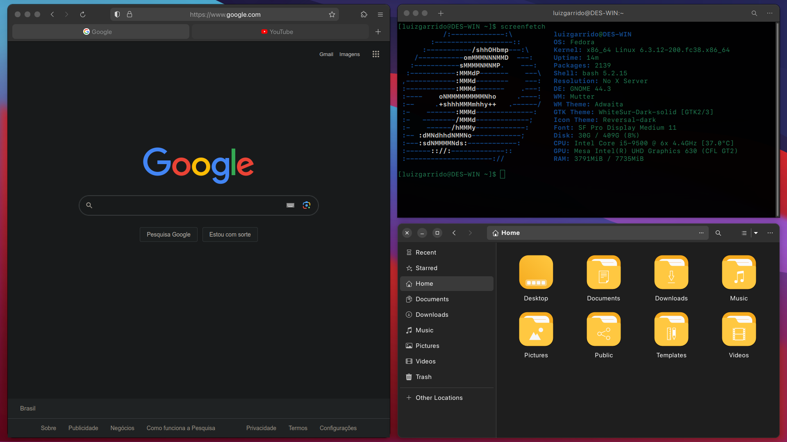

# Fedora Initial Configuration
### Scripts para personalizar o Fedora Workstation



## Como executar
Abra o Terminal Linux e execute os seguintes comandos:

- Para baixar o repositório na sua máquina:

```
$ git clone https://github.com/lcgds/my-fedora-config
```

- Para dar permissão de execução aos scripts:

```
$ sudo chmod +x ./my-fedora-config/
```

- Para executar o script completo:

```
$ cd ./my-fedora-config/
$ ./install.sh
```