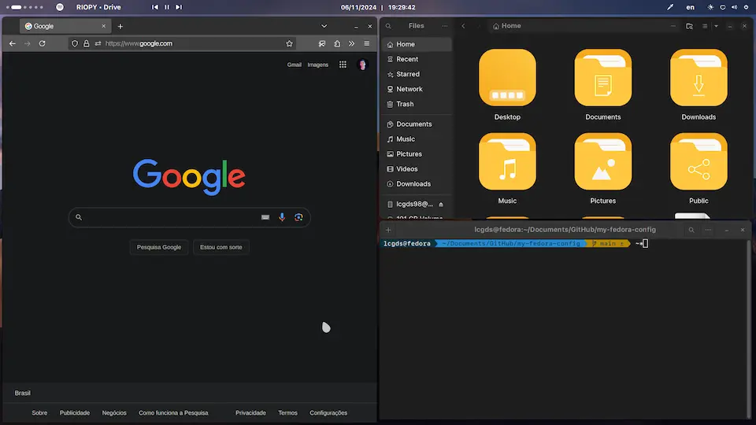

# Fedora Initial Configuration
### Scripts para personalizar o Fedora Workstation



## Como instalar
Abra o Terminal e execute os seguintes comandos:

1. Para baixar o repositório na sua máquina:

```bash
git clone https://github.com/lcgds/my-fedora-config
```

2. Para dar permissão de execução aos scripts:

```bash
sudo chmod +x ./my-fedora-config/
```

3. Para executar o script:

```bash
cd ./my-fedora-config/
./install.sh (parâmetros opcionais *)
```

<details> <summary>* Parâmetros opcionais</summary>
- <b>-g</b> para instalar apenas de pacotes gerais; ou
- <b>-d</b> para instalar pacotes de desenvolvimentos além dos gerais."
</details>